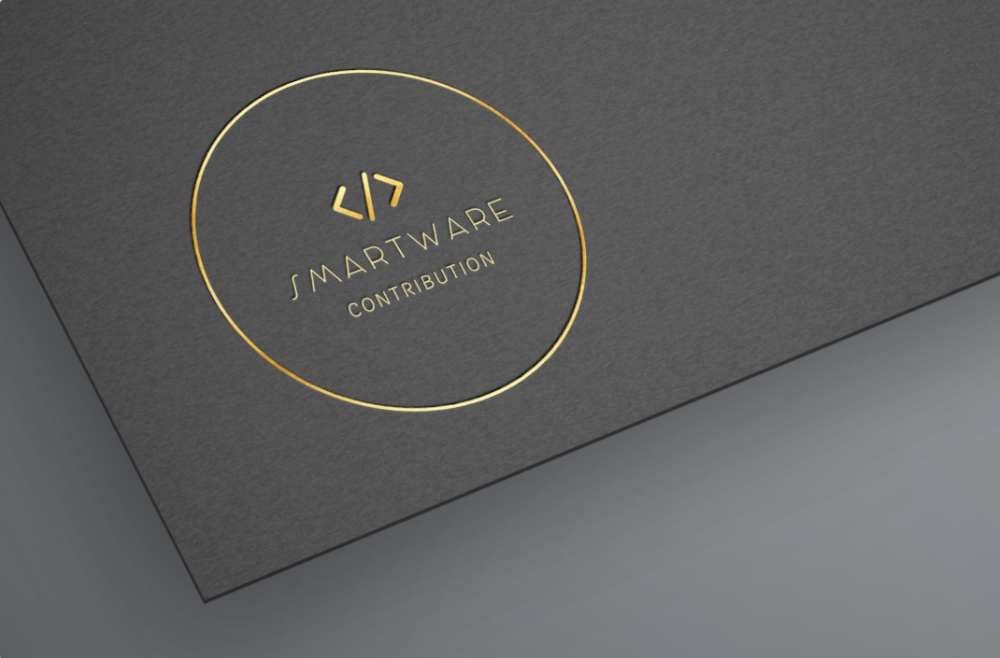

# Contributing to the Smartare project #

First of all, thank you for taking the time to contribute to our wonderful school project ! 🎉

## Code of conduct ##

This project is governed by the code of conduct of the pns-si3-qgl and the University of Nice-Sophia Antipolis (Polytech) rules. Please report unacceptable behavior
to the head of this Module, Mathias Cousté.

## How to contribute ##

### Branches Organization ###

The branches workflow is the following (GitFlow) :

* **master** : Always stable version + Hotfixes
* **development** : General assembly, Refactorings 
* **feature/<feature_name>** : To add new features
* **gh-pages** : Reserved for PiTest build reports

### Pull Requests submission ###

In our team, we will do Pull Requests only for merging in the master branch. This way, once we've individually added features and we've done the integration with
tests, we can create a Pull Request to show everyone what the changes will be on the stable version of the Smartware project, and ask if everyone is ok to submit
the changes.

### Discussion ###

The two networks that we mainly use for team-working on the projects are :
* Discord (a dedicated room for 'QGL' projects)
* Slack (a private channel 'si3-qgl-20-21...' used for communication with our teachers/education team).

### Source code style ###

The IDE we mainly use for coding on Smartware project is IntelliJ IDEA. The source file coding standards (indentation, Java custom-made recommendations) are the
ones from the JetBrains editor. Please refer to the IntelliJ IDEA standards to understand what stuff could be different from other IDEs or Text Editors.
