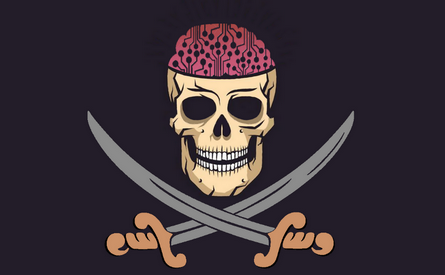

# Smartware 

Nous avons réalisé ce projet dans le cadre de notre **formation d'Ingénieur en Sciences Informatiques** à **l'École Polytechnique de l'Université de Nice** (Polytech Nice-Sophia).

### Les tests de mutations sont accessibles ici
https://pns-si3-qgl.github.io/pns-si3-qgl-2021-smartware/

## Flag
  

## Membres de notre équipe :
 - Mathias CARASCO
 - Nicolas PERRIN
 - Antoine DESANTI
 - Matthieu HEBRARD
 
 ## Nom de notre Bateau
 **HoverBoat**
 
